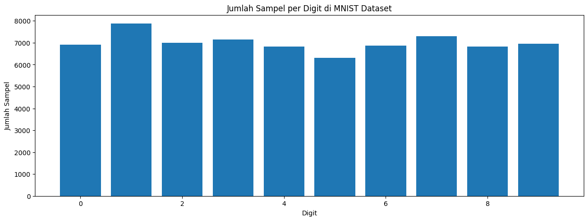
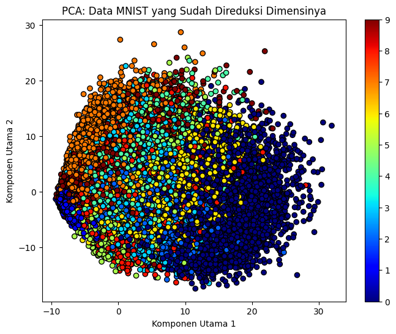
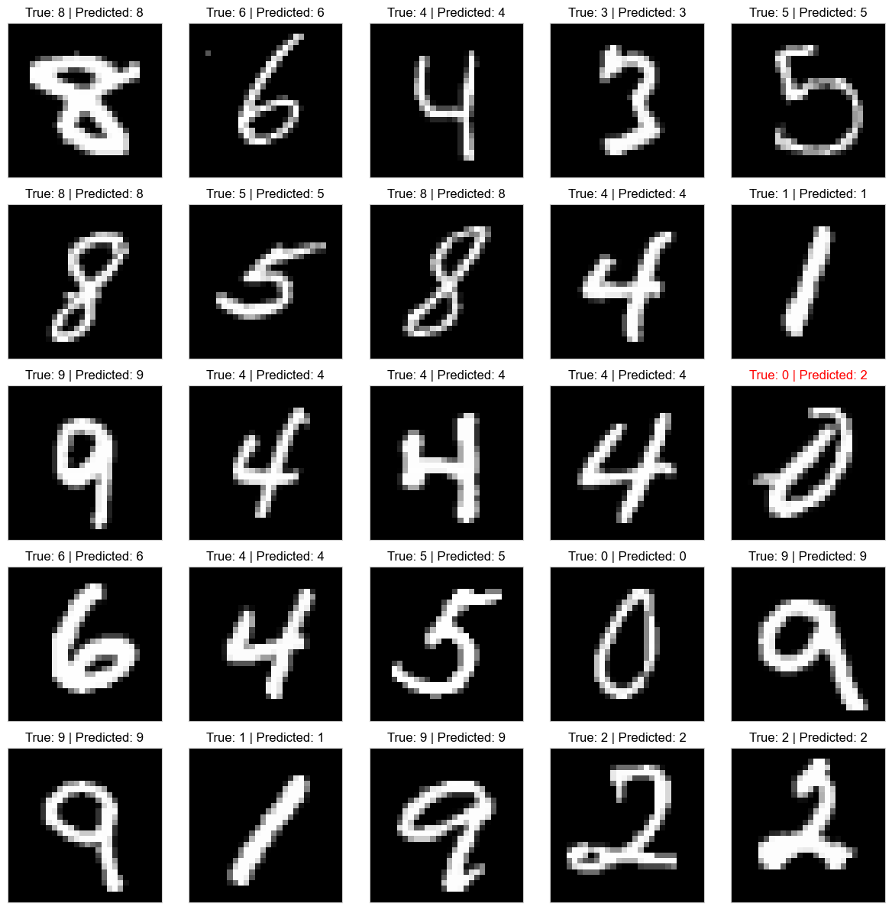
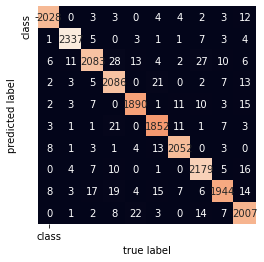
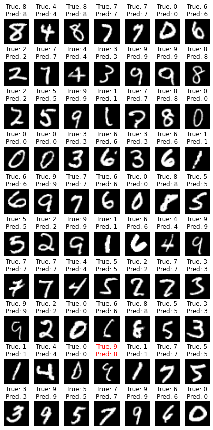
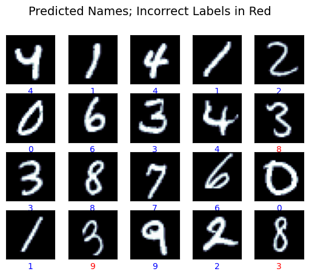
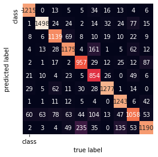
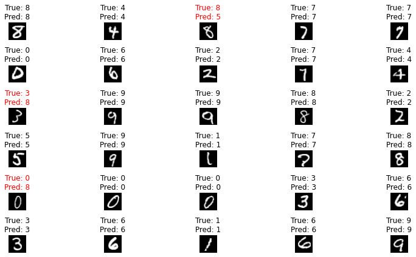

# Kuis 1 - Machine Learning

### Anggota Kelompok 4:
1. Ilham Yudantyo (2141720091)
2. Mohammad Izamul Fikri Fahmi (2141720171)
3. Septi Lutfiana (2141720038)
4. Ulfi Mustatiq Abidatul Izza (2141720052)
5. Muhammad Ali Zulfikar (2141720088)

## Memastikan jumlah data setiap label dan Membuktikan data imbalance pada dataset MNIST

Pertama kita melihat keseimbangan jumlah dataset yang terdapat di MNIST Dataset. Dalam analisis ini, jumlah data terbukti seimbang, yang dibuktikan dengan perhitungan menggunakan rumus berikut:

$CV = \frac{\text{Standard Deviation}}{\text{Mean}} \times 100$

Perhitungan Koefisien Varians dilakukan untuk melihat varians data, dan ditemukan bahwa CV mencapai hanya 5%. Selanjutnya, hasil ini juga diperkuat dengan visualisasi distribusi data menggunakan bar chart.

Kemudian, Kelompok 4 melakukan perbandingan antara model SVM (Support Vector Machine) dan Naive Bayes. Berikut adalah hasil perbandingan tersebut:

## Klasifikasi dengan menggunakan algoritma SVM

1. **SVC Kernel RBF dengan C = 1 dan Gamma = 0.01**

   - Model menggunakan SVC kernel rbf dengan parameter C = 1 dan Gamma = 0.01.
   - Proses preprocessing melibatkan PCA dengan 60 komponen yang dibagi menjadi data latih sebesar 70% dan data uji sebesar 30%.
   - Hasil prediksi mencapai akurasi 93%.

    [1]

2. **SVC dengan Hyperparameter Tuning**

   - Model SVC diuji dengan hyperparameter tuning menggunakan GridSearchCV dengan variasi nilai C dan gamma.
   - Parameter terbaik yang ditemukan adalah `{'svc__C': 10, 'svc__gamma': 0.01}`, dengan akurasi mencapai 97%.
   - Confusion matrix dan hasil prediksi gambar juga ditampilkan.

   
     [4,5]

## Klasifikasi dengan menggunakan algoritma Naive Bayes

3. **Naive Bayes dengan 5 Parameter**

   - Model Naive Bayes menggunakan 5 parameter yang berbeda dengan var_smoothing sebagai salah satu parameter.
   - Ditemukan bahwa model mendapatkan akurasi sebesar 87.25%, dengan parameter terbaik adalah `1e-05`.

    [2]

4. **Naive Bayes MultinomialNB**

   - Model ini menggunakan jenis model Multinomial Naive Bayes dengan Alpha (n_features) di-set menjadi 1.0.
   - Hasil akurasi data latih mencapai 82.6% dan data uji mencapai 82.9%.
   - Confusion matrix dan hasil prediksi gambar juga ditampilkan.

   
   

5. **Gaussian Naive Bayes**
   - Model ini menggunakan jenis model Gaussian Naive Bayes dengan Alpha (n_features) di-set menjadi 1.0.
   - Hasil akurasi data latih mencapai 81.97% dan data uji mencapai 81.87%.

**Kesimpulan**

Dari beberapa perbandingan metode klasifikasi yang telah kita lakukan diatas, kita dapat menyimpulkan bahwa:
- SVC Kernel RBF dengan C = 1 dan Gamma = 0.01

| Test Size | Accuracy   |
|-----------|------------|
| 0.3       | 93%        |
| 0.2       | 93%        |
| 0.1       | 93%        |

- SVC dengan Hyperparameter Tuning

| Test Size | Accuracy   |
|-----------|------------|
| 0.3       | 97.52%        |
| 0.2       | 97.56%     |
| 0.1       | 97.46%     |
  
- Naive Bayes dengan 5 Parameter

| Test Size | Accuracy   |
|-----------|------------|
| 0.3       | 87.58%     |
| 0.2       | 87.58%     |
| 0.1       | 87.58%     |
  
- Naive Bayes MultinomialNB

| Test Size | Accuracy   |
|-----------|------------|
| 0.3       | 82.5%      |
| 0.2       | 82.9%      |
| 0.1       | 82.9%      |
  
- Naive Bayes Gaussian

| Test Size | Accuracy   |
|-----------|------------|
| 0.3       | 81.8%     |
| 0.2       | 82.1%     |
| 0.1       | 81.8%     |

Sehingga, dari hasil percobaan yang kami lakukan dapat disimpulkan bahwa klasifikasi **SVM dengan Hyperparameter Tuning** memliki akurasi yang paling tinggi yaitu memiliki tingkat akurasi 97.56% untuk test size 0.2. Sedangkan, pada klasifikasi Naive Bayes Gaussian memiliki tingkat akurasi yang paling rendah yaitu 81.8% untuk test size 0.3 dan 0.1. 

Referensi Model:
[1] [SVC RBF Model MNIST - Ali Zulfikar](https://github.com/alizul01/machine-learning-course/blob/main/05%20-%20Quiz/Quiz_Challenge.ipynb)
[2] [Naive Bayes for MNIST - Izamul Fikri](https://github.com/zenosance/machine-learning/blob/main/Pembelajaran_Mesin_Kuis_1_Naive_Bayes.ipynb)
[3] [MultinomialNB Naive Bayes for MNIST - Ulfi Izza](https://github.com/ulfiizza27/2141720052-Machine-Learning-2023/blob/main/Week%205/NaiveBayes_Multinominal.ipynb)
[4] [SVM Hyperparameter Tuning - Ulfi Izza](https://github.com/ulfiizza27/2141720052-Machine-Learning-2023/blob/main/Week%205/SVM.ipynb)
[5] [SVM Hyperparameter Tuning - Ilham Yudantyo](https://github.com/ilhamydn17/2141720091-MachLearn-2023/blob/week-05-kuis1/kuis_1_result.ipynb)
[6] [SVM]()
